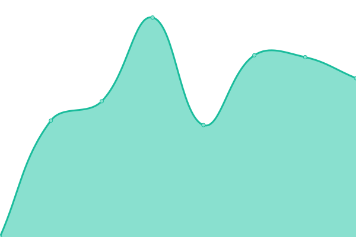

# [📈 Live Status](https://ilger00.github.io/Uptime): <!--live status--> **🟩 All systems operational**

This repository contains the open-source uptime monitor and status page for [ilger00](https://ilger00.github.io/Uptime), powered by [Upptime](https://github.com/upptime/upptime).

With [Upptime](https://upptime.js.org), you can get your own unlimited and free uptime monitor and status page, powered entirely by a GitHub repository. We use [Issues](https://github.com/ilger00/Uptime/issues) as incident reports, [Actions](https://github.com/ilger00/Uptime/actions) as uptime monitors, and [Pages](https://ilger00.github.io/Uptime) for the status page.

<!--start: status pages-->
<!-- This summary is generated by Upptime (https://github.com/upptime/upptime) -->
<!-- Do not edit this manually, your changes will be overwritten -->
<!-- prettier-ignore -->
| URL | Status | History | Response Time | Uptime |
| --- | ------ | ------- | ------------- | ------ |
|  Ilger | 🟩 Up | [ilger.yml](https://github.com/ilger00/Uptime/commits/HEAD/history/ilger.yml) | 

 2208ms
     
 | 

<a href="https://ilger00.github.io/Uptime/history/ilger">100.00%</a>
    

|  MTA1 | 🟩 Up | [mta-1.yml](https://github.com/ilger00/Uptime/commits/HEAD/history/mta-1.yml) | 

 141ms
     
 | 

<a href="https://ilger00.github.io/Uptime/history/mta-1">100.00%</a>
    

|  MTA2 | 🟩 Up | [mta-2.yml](https://github.com/ilger00/Uptime/commits/HEAD/history/mta-2.yml) | 

 141ms
     
 | 

<a href="https://ilger00.github.io/Uptime/history/mta-2">100.00%</a>
    

|  MTA3 | 🟩 Up | [mta-3.yml](https://github.com/ilger00/Uptime/commits/HEAD/history/mta-3.yml) | 

 140ms
     
 | 

<a href="https://ilger00.github.io/Uptime/history/mta-3">100.00%</a>
    

|  MTA4 | 🟩 Up | [mta-4.yml](https://github.com/ilger00/Uptime/commits/HEAD/history/mta-4.yml) | 

 141ms
     
 | 

<a href="https://ilger00.github.io/Uptime/history/mta-4">100.00%</a>
    

|  MTA5 | 🟩 Up | [mta-5.yml](https://github.com/ilger00/Uptime/commits/HEAD/history/mta-5.yml) | 

 169ms
     
 | 

<a href="https://ilger00.github.io/Uptime/history/mta-5">100.00%</a>
    

|  MTA6 | 🟩 Up | [mta-6.yml](https://github.com/ilger00/Uptime/commits/HEAD/history/mta-6.yml) | 

 140ms
     
 | 

<a href="https://ilger00.github.io/Uptime/history/mta-6">100.00%</a>
    

|  MTA7 | 🟩 Up | [mta-7.yml](https://github.com/ilger00/Uptime/commits/HEAD/history/mta-7.yml) | 

 140ms
     
 | 

<a href="https://ilger00.github.io/Uptime/history/mta-7">100.00%</a>
    

|  MTA8 | 🟩 Up | [mta-8.yml](https://github.com/ilger00/Uptime/commits/HEAD/history/mta-8.yml) | 

 139ms
     
 | 

<a href="https://ilger00.github.io/Uptime/history/mta-8">100.00%</a>
    

|  PRX1 | 🟩 Up | [prx-1.yml](https://github.com/ilger00/Uptime/commits/HEAD/history/prx-1.yml) | 

 862ms
     
 | 

<a href="https://ilger00.github.io/Uptime/history/prx-1">99.81%</a>
    

|  PRX2 | 🟩 Up | [prx-2.yml](https://github.com/ilger00/Uptime/commits/HEAD/history/prx-2.yml) | 

 888ms
     
 | 

<a href="https://ilger00.github.io/Uptime/history/prx-2">100.00%</a>
    

|  PRX3 | 🟩 Up | [prx-3.yml](https://github.com/ilger00/Uptime/commits/HEAD/history/prx-3.yml) | 

 878ms
     
 | 

<a href="https://ilger00.github.io/Uptime/history/prx-3">100.00%</a>
    

|  PRX4 | 🟩 Up | [prx-4.yml](https://github.com/ilger00/Uptime/commits/HEAD/history/prx-4.yml) | 

 884ms
     
 | 

<a href="https://ilger00.github.io/Uptime/history/prx-4">100.00%</a>
    

|  NEWS02_BIBLIO | 🟩 Up | [news-02-biblio.yml](https://github.com/ilger00/Uptime/commits/HEAD/history/news-02-biblio.yml) | 

 1389ms
     
 | 

<a href="https://ilger00.github.io/Uptime/history/news-02-biblio">100.00%</a>
    

|  MX8 | 🟩 Up | [mx-8.yml](https://github.com/ilger00/Uptime/commits/HEAD/history/mx-8.yml) | 

 141ms
     
 | 

<a href="https://ilger00.github.io/Uptime/history/mx-8">100.00%</a>
    

|  MX9 | 🟩 Up | [mx-9.yml](https://github.com/ilger00/Uptime/commits/HEAD/history/mx-9.yml) | 

 141ms
     
 | 

<a href="https://ilger00.github.io/Uptime/history/mx-9">100.00%</a>
    

|  MX10 | 🟩 Up | [mx-10.yml](https://github.com/ilger00/Uptime/commits/HEAD/history/mx-10.yml) | 

 141ms
     
 | 

<a href="https://ilger00.github.io/Uptime/history/mx-10">100.00%</a>
    

|  MX11 | 🟩 Up | [mx-11.yml](https://github.com/ilger00/Uptime/commits/HEAD/history/mx-11.yml) | 

 141ms
     
 | 

<a href="https://ilger00.github.io/Uptime/history/mx-11">100.00%</a>
    

|  MX12 | 🟩 Up | [mx-12.yml](https://github.com/ilger00/Uptime/commits/HEAD/history/mx-12.yml) | 

 140ms
     
 | 

<a href="https://ilger00.github.io/Uptime/history/mx-12">100.00%</a>
    

|  PRX_Z_1 | 🟩 Up | [prx-z-1.yml](https://github.com/ilger00/Uptime/commits/HEAD/history/prx-z-1.yml) | 

 900ms
     
 | 

<a href="https://ilger00.github.io/Uptime/history/prx-z-1">100.00%</a>
    

|  PRX_Z_2 | 🟩 Up | [prx-z-2.yml](https://github.com/ilger00/Uptime/commits/HEAD/history/prx-z-2.yml) | 

 913ms
     
 | 

<a href="https://ilger00.github.io/Uptime/history/prx-z-2">100.00%</a>
    

|  PRX_Z_3 | 🟩 Up | [prx-z-3.yml](https://github.com/ilger00/Uptime/commits/HEAD/history/prx-z-3.yml) | 

 1170ms
     
 | 

<a href="https://ilger00.github.io/Uptime/history/prx-z-3">100.00%</a>
    

|  PRX_Z_4 | 🟩 Up | [prx-z-4.yml](https://github.com/ilger00/Uptime/commits/HEAD/history/prx-z-4.yml) | 

 1142ms
     
 | 

<a href="https://ilger00.github.io/Uptime/history/prx-z-4">100.00%</a>
    

<!--end: status pages-->

[**Visit our status website →**](https://ilger00.github.io/Uptime)

## 📄 License

- Powered by: [Upptime](https://github.com/upptime/upptime)
- Code: [MIT](./LICENSE) © [ilger00](https://ilger00.github.io/Uptime)
- Data in the `./history` directory: [Open Database License](https://opendatacommons.org/licenses/odbl/1-0/)
